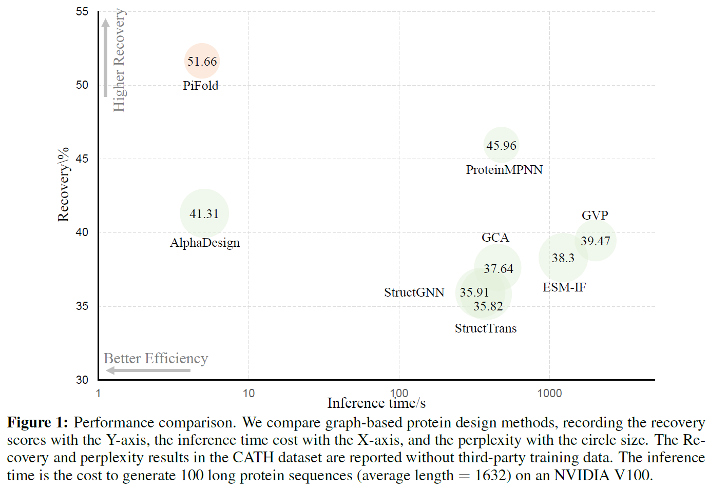
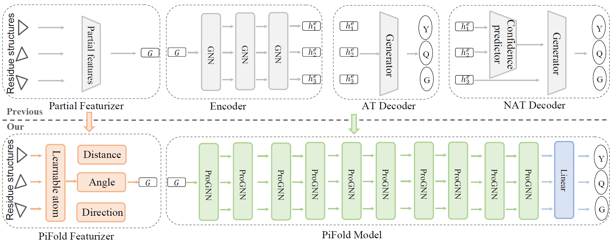
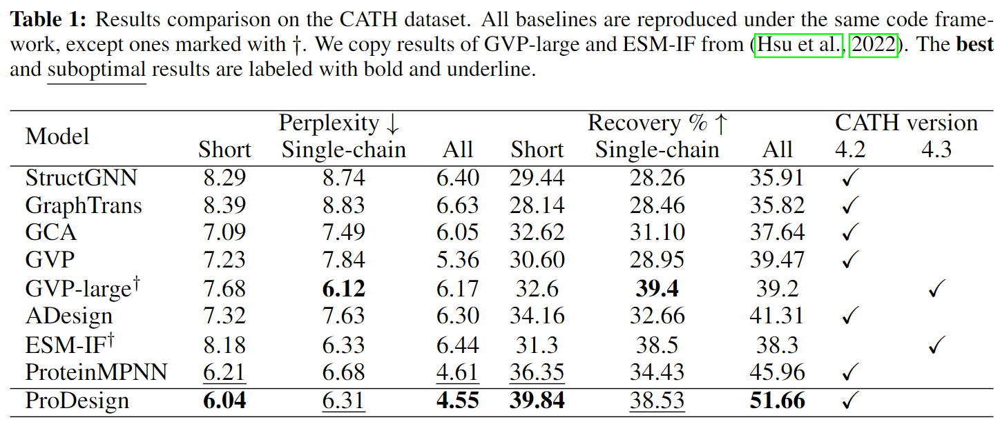
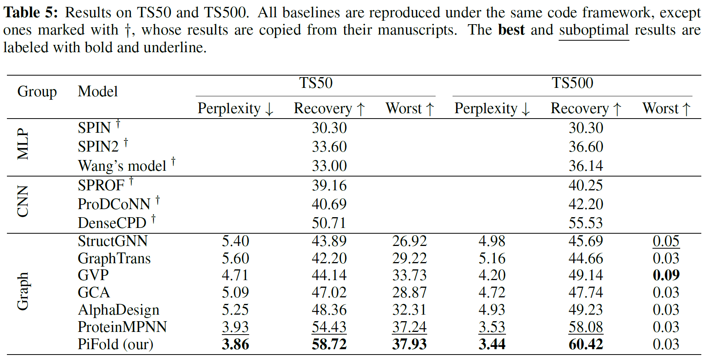

# PiFold: Toward effective and efficient protein inverse folding

The pre-print paper is available at [this link](https://github.com/A4Bio/ProDesign/blob/main/assets/PiFold_arxiv.pdf).

Note that we renamed **ProDesign** to **PiFold** to avoid naming conflicts with previous work

## 1. Introduction
How can we design protein sequences folding into the desired structures effectively and efficiently? Structure-based protein design has attracted increasing attention in recent years; however, few methods can simultaneously improve the accuracy and efficiency due to the lack of expressive features and autoregressive sequence decoder. To address these issues, we propose PiFold, which contains a novel residue featurizer and PiGNN layers to generate protein sequences in a one-shot way with improved recovery. Experiments show that PiFold could achieve 51.66\% recovery on CATH 4.2, while the inference speed is 70 times faster than the autoregressive competitors. In addition, PiFold achieves 58.72\% and 60.42\% recovery scores on TS50 and TS500, respectively. We conduct comprehensive ablation studies to reveal the role of different types of protein features and model designs, inspiring further simplification and improvement.

  

## 2. Framework
We show the overall PiFold framework. The inputs are protein structures, and outputs are protein sequences expected to fold into the input structures. We propose a novel residue featurizer and PiGNN layer to learn expressive residue representations. Specifically, the residue featurizer constructs comprehensive residue features and creates learnable virtual atoms to capture information complementary to real atoms. The PiGNN 
considers multi-scale residue interactions in node, edge, and global context levels. PiFold could generate protein sequences in a one-shot manner with a higher recovery than previous autoregressive or iterative models.

  

## 3. Benchmarking
We comprehensively evaluate different results on CATH, TS50 and TS500. 

  

  

You can reproduce results of PiFold on colab:

<!-- ## 3. Model Zoom -->

## 4. Fixed backbone design using model trained on CATH 4.2.
For a given protein backbone design a new sequence that folds into that conformation: 

<!-- [[Colab]](https://colab.research.google.com/drive/1z6vpKA5L1iAmBLfREbmy8VNOtDYlkY4Q?usp=sharing) -->

## Feedback
If you have any issue about this work, please feel free to contact me by email: 
* Zhangyang Gao: gaozhangyang@westlake.edu.cn
* Cheng Tan: tancheng@westlake.edu.cn
