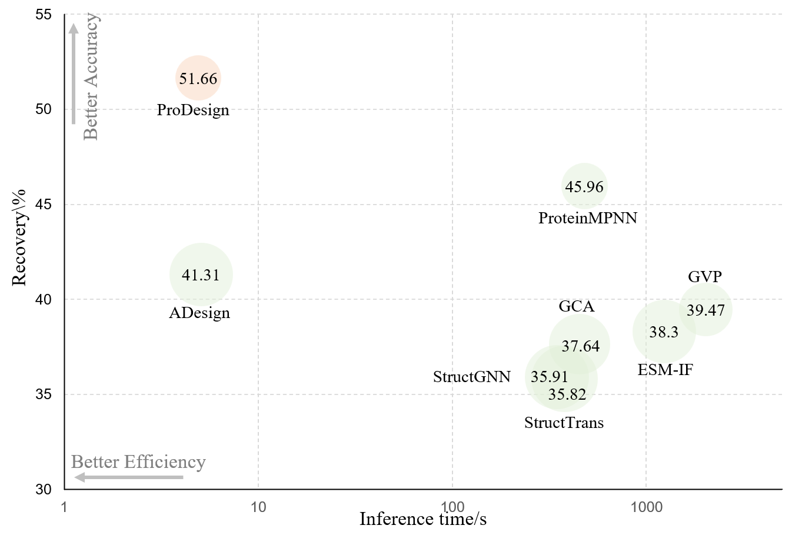

# ProDesign: ProDesign: Toward effective and efficient protein design

## 1. Introduction
How to design protein sequences folding into the desired structures effectively and efficiently? Structure-based protein design has attracted increasing attention in recent years; however, few methods can simultaneously improve the accuracy and efficiency due to the lack of expressive features and autoregressive sequence decoder. To address these issues, we propose ProDesign, which contains a novel residue featurizer and ProGNN layers to generate protein sequences in a one-shot way with improved recovery. Experiments show that ProDesign could achieve 51.66\% recovery on CATH 4.2, while the inference speed is 70 times faster than the autoregressive competitors. In addition, ProDesign achieves 58.72\% and 60.42\% recovery scores on TS50 and TS500, respectively. We conduct comprehensive ablation studies to reveal the role of different types of protein features and model designs, inspiring further simplification and improvement.

  

## 2. Benchmarking

## 3. Model Zoom

## 4. Colab

